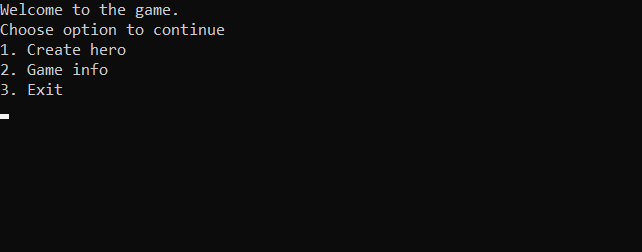
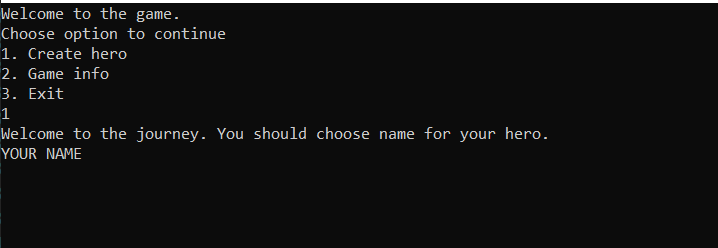
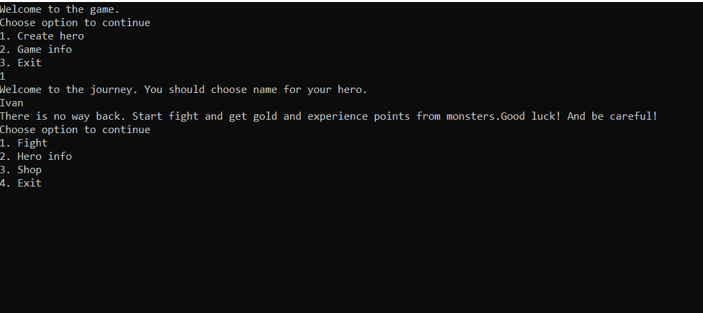
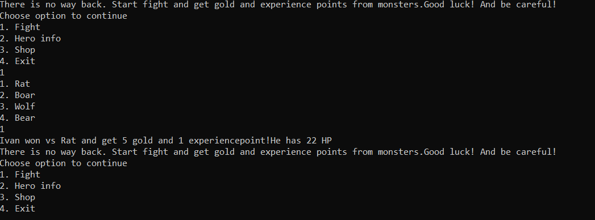

# RpgGame

How to Install and Run the Project?  ⚙️

<ol>
<li>git clone https://github.com/EmilStanchev/RpgGame.git</li>
<li>Open the project with Visual Studio </li>
<li>You almost ready. You just need to start the project: CTRL+F5</li>
<li>Follow the instructions in the game!</li>
<li>If you're still having trouble take a look to Screenshots</li>
</ol>

 

Game Description 🎮

A simple console game where you have to escape from the catacombs. To do this, you need to create a character with a unique name and face the fearsome monsters that stalk you from everywhere.

Features in the game:

<ol>
<li>You can buy items from the shop</li>
<li>You can fight with monsters</li>
<li>Leveling up system</li>
</ol>

 
The game is for educational purposes!

 

# Technologies Used 🔑

 
# Developers 👨🏻‍💻
## Architecture 🔧
 

Project Overview 🧐

This project is an educational console role-playing game developed in C#. The project is organized into several folders, each with a specific purpose. I believe that educational games can be both fun and beneficial, so I designed this game to help reinforce key concepts in a fun and engaging way. Whether you're a student or just looking to learn something new, this game is designed to challenge your skills and expand your knowledge.

 

Logic folder 📂

The Logic folder contains all of the services and the main logic for the game. This includes the game mechanics, such as combat and character progression. The services are responsible for managing various aspects of the game, such as handling inputs and outputs, managing the game state, and handling interactions between different game objects.

 

Interface folder 📂

The Interface folder contains all of the interfaces that are used throughout the game. These interfaces define the various components of the game, such as the player, enemies, items, and abilities. This allows for greater flexibility and easier maintenance of the code.

 

Models folder 📂

The Models folder contains all of the classes that describe the various game objects, such as the heroes and items. These classes are used by the game logic to manage the game state and handle interactions between objects. Additionally, there are several helper classes included in the project. These classes are responsible for reading input from the console and writing output to the console, making it easier to interact with the game.

 

RpgGame folder 📂

The 'RpgGame' folder contains the main entry point for the application, including the 'Program.cs' file and the Ninject configuration. Ninject is used to manage dependency injection throughout the application, making it easier to maintain and modify the code.

 

Benefits 🔥

Overall, this project provides a solid foundation for building a robust and engaging console role-playing game in C#. The well-organized structure, use of interfaces, and dependency injection with Ninject and Ninject Factory make it easy to extend and modify the game logic as needed.

 

## Your ideas 💡

Collaborating for a Better RPG Game: Your Ideas Welcome 📢

I believe that software developers are some of the most creative and innovative people out there. That's why I welcome your ideas on how we can expand and improve our C# console role-playing game. Whether it's a new feature you'd like to see, a way to optimize game performance, or a bug you've noticed, I am always eager to hear from our community. I encourage you to reach out to us and share your thoughts on how I can make this game even better. I am here to collaborate with you and build a fun, engaging, and memorable gaming experience for all.

 

# Screenshots 📸
<h3>Start menu: </h3>

<h3>Pick a name for your hero: </h3>

<h3>After create hero: </h3>

<h3>Fight with monster: </h3>
